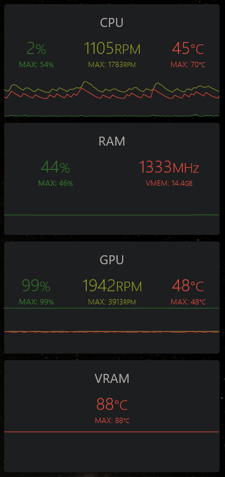

# SysOverview Widgets

A rainmeter skin to monitor PC system resources usage.

Meters:

- CPU: load, fan RPM, temp.
- RAM: load, clock, SWAP usage.
- GPU: load, fan RPM, temp.
- VRAM: junction temp.

Screenshot:

Requierements:

- Rainmeter 4.3.1+
- HWiNFO 6.42+, make sure Shared Memory Support & Auto Start are enabled.

Usage:

Use the included HWiNFOSharedMemoryViewer.exe to get sensors for your system and edit \@Resources\Setting.inc to your preferences.